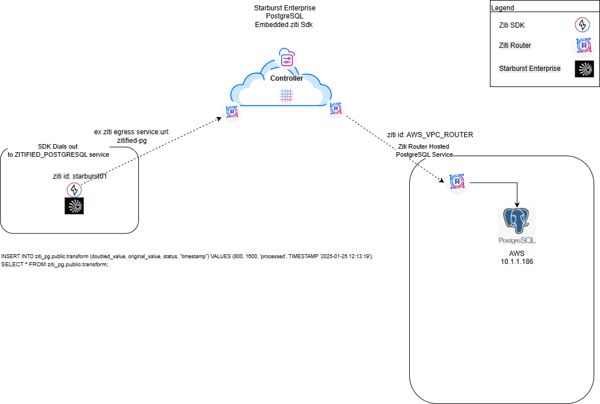
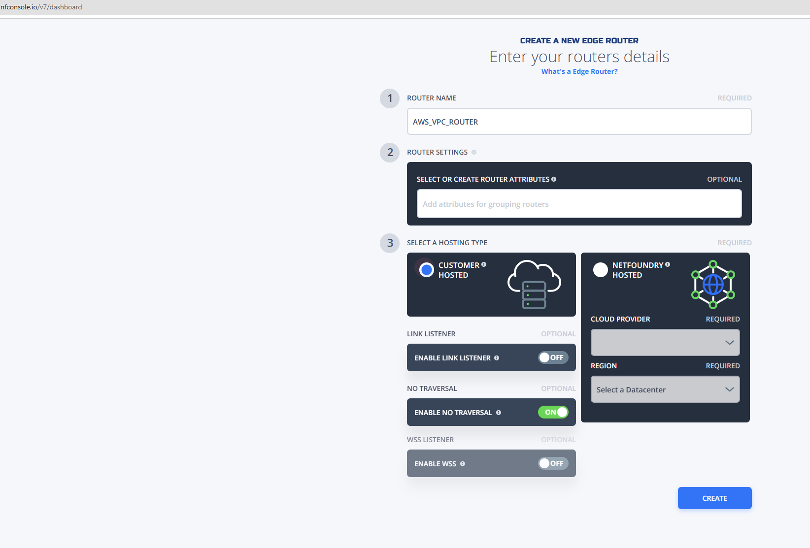
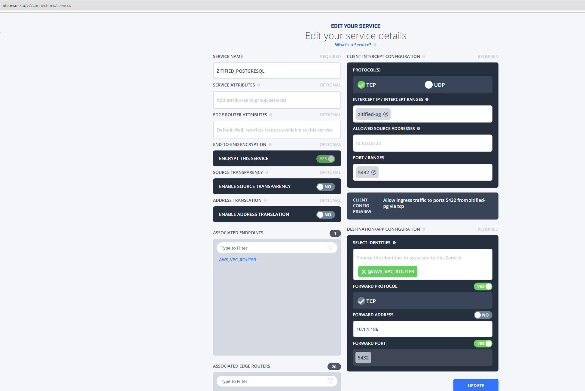
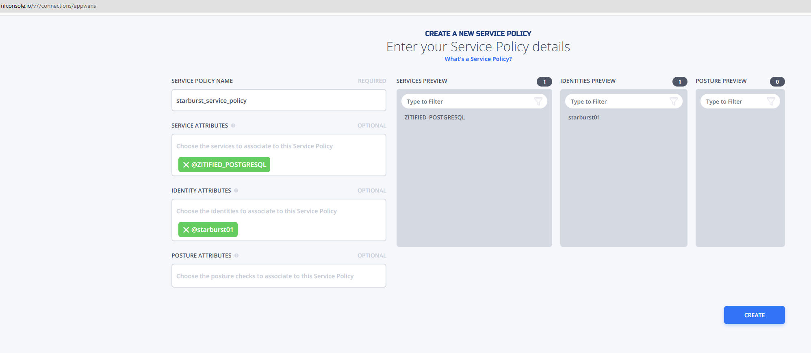
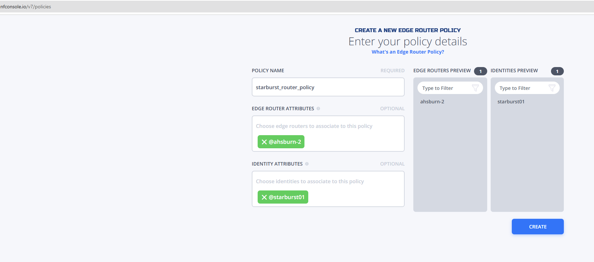

# Zitified-Starburst-Prostgres

zitified-starburst-postgres example builds on the community-driven Ziti trino connector in
 [zitified-trino-postgres](https://github.com/netfoundry/zitified-trino-postgres).

TThis project demonstrates how a custom OpenZiti-enabled plugin can be deployed into a hardened
 Starburst Enterprise (SEP) environment without changing a single line of core networking code.
By simply re-aligning the volume mounts to accommodate the Enterprise configuration root (/etc/starburst),
 Starburst Enterprise can securely pull data from a 'Dark' PostgreSQL server that has no open inbound ports.

# How it works:

Starburst loads the stock Postgres connector. The Catalog configuration (ziti_pg.properties) specifies our custom 
ZitiPostgresSocketFactory. The Plugin (ZitiPostgresPlugin) ensures the OpenZiti SDK and our interceptor class 
are available in the JVM's classpath. The Driver hands off socket creation to our code, which authenticates
via the OpenZiti Identity and tunnels the traffic over the secure Ziti fabric.

## Build the Example
On the linux system that will run the host the Starburst docker container:

Pre-reqs:
- Install maven if not already installed.

- Install docker / docker compose V2 if not already installed.

- Install java jdk 21.
```
mkdir repos
cd repos
git clone https://github.com/r-caamano/zitified-starburst-postgres.git
cd zitified-starburst-postgres
mvn clean package -nsu
cp target/trino-postgres-ziti-1.0.0.jar starburst-ziti-test/plugin/ziti-postgres
```

## Setup and Configure the Example



Create or use an existing ziti network with at least one edge router. This can be accomplished using the Netfoundry
Console.


1. Create and enroll one ziti identity
   ```
   a. starburst01
      Enroll the identity and name the identity file identity.json and place in the 
      repos/zitified-starburst-postgres/starburst-ziti-test folder on the linux system in "Build the Example" section 
      above.
   ```
The following assumes naming in the network diagram but can be substituted per preference:

2. Create a self hosted ziti edge-router in the same AWS vpc where your postgreSQL server will be configured e.g. AWS_VPC_ROUTER.

   a. NetFoundry Console

   

   b. Follow the steps here to install the router into your AWS VPC [Instructions](https://support.netfoundry.io/hc/en-us/articles/360016342971-Deployment-Guide-for-AWS-Edge-Routers)

3. Create an advanced service named ZITIFIED_POSTGRESQL.  Set the protocol to "tcp", set the intercept ip to "zitified-pg",
   set the port to 5432, Select identity @, set forward address to no and address to the private VPC address of the postgreSQL server 
   e.g. 10.1.1.186 and set forward port to yes.

   

4. Create a Service Policy to enable starburst01 to access the ZITIFIED_POSTGRESQL service
   

5. 6. Create a router policy and with the NF hosted edge-router and starburst01 as the identity e.g.



6. Install and setup postgreSQL server on vm in the same vpc as your edge-router in step 2. Ensure that you add an inbound firewall rule to allow
   tcp port 5432 in from the private cidr address of the ziti edge router. e.g.  Also ensure postgreSQL server is configured to accept connections from the 
   private cidr address of the ziti edge-router.

   

7. Create db: mydb, user: myuser, password: mypassword, grant all permissions on mydb to myuser

8. create table transform e.g. 
   ```CREATE TABLE transform (
       id SERIAL PRIMARY KEY,          -- auto‑incrementing unique identifier
       doubled_value   INTEGER NOT NULL,
       original_value  INTEGER NOT NULL,
       status          VARCHAR(50) NOT NULL,
       timestamp       TIMESTAMP NOT NULL
       );
   ```

9. On the starburst01 host perform the following from the repos/zitified-starburst-postgres/starburst-ziti-test folder

   ```
   sudo docker compose down && sudo docker compose up -d && sudo docker logs starburst-ziti -f
   ```
   You should see this line at when it finishes loading
   ```
   2026-01-29T19:54:07.505Z	INFO	main	io.trino.server.Server	======== SERVER STARTED ========

   ```
10. From another terminal window on the starburst01 host

   ```
   sh test-insert.sh

   #output
   
   sh test-insert.sh 
   Initial NextURI: http://localhost:8080/v1/statement/queued/20260129_200635_00005_rmf6y/ydcf913635413b1e968f1311d9c9e39291e23e732/1
   Polling: http://localhost:8080/v1/statement/queued/20260129_200635_00005_rmf6y/ydcf913635413b1e968f1311d9c9e39291e23e732/1
   Current State: QUEUED
   Polling: http://localhost:8080/v1/statement/queued/20260129_200635_00005_rmf6y/y62d5c887fb6f8bd0a32027299c0186cb20e0a18c/2
   Current State: QUEUED
   Polling: http://localhost:8080/v1/statement/executing/20260129_200635_00005_rmf6y/y150ec0c1db1469ca9f2779c782059706355e096b/0
   Current State: RUNNING
   Polling: http://localhost:8080/v1/statement/executing/20260129_200635_00005_rmf6y/y25ac0efd986798996aa1de0787a5d9c648db66ec/1
   Current State: FINISHED
   DATA FOUND:
   [
   [
      1
   ]
   ]
   
   sh test-select.sh

   #output

   Initial NextURI: http://localhost:8080/v1/statement/queued/20260129_200644_00006_rmf6y/y0234a86d4afcbb1581e7952559c05595f1013150/1
   Polling: http://localhost:8080/v1/statement/queued/20260129_200644_00006_rmf6y/y0234a86d4afcbb1581e7952559c05595f1013150/1
   Current State: QUEUED
   Polling: http://localhost:8080/v1/statement/queued/20260129_200644_00006_rmf6y/yc56d3b88203c59168c461e54841e269eb07c7c03/2
   Current State: QUEUED
   Polling: http://localhost:8080/v1/statement/executing/20260129_200644_00006_rmf6y/yb61bf06c72749c6a1cae90fbddaabea1f088e821/0
   Current State: RUNNING
   Polling: http://localhost:8080/v1/statement/executing/20260129_200644_00006_rmf6y/y84051dc5bc5fa82dcb44fbb5c2bf6934c7be9a72/1
   Current State: FINISHED
   DATA FOUND:
   [
   [
      1,
      800,
      1600,
      "processed",
      "2025-01-25 12:13:19.000"
   ]
   ]
   ```

11. In the terminal open in step 9 should see output similar to 

   ```
   2026-01-29T20:22:44.171Z	INFO	Query-20260129_202244_00007_rmf6y-517	stderr	>>>> [ZITI DEBUG] Resolved zitified-pg to 100.64.1.2
   2026-01-29T20:22:44.171Z	INFO	Query-20260129_202244_00007_rmf6y-517	stderr	>>>> [ZITI DEBUG] Dialing: 100.64.1.2:5432
   2026-01-29T20:22:44.874Z	INFO	20260129_202244_00007_rmf6y.0.0.0-8-97	stderr	>>>> [ZITI DEBUG] Resolved zitified-pg to 100.64.1.2
   2026-01-29T20:22:44.874Z	INFO	20260129_202244_00007_rmf6y.0.0.0-8-97	stderr	>>>> [ZITI DEBUG] Dialing: 100.64.1.2:5432
   2026-01-29T20:22:47.281Z	INFO	dispatcher-query-26	io.trino.event.QueryMonitor	TIMELINE: Query 20260129_202244_00007_rmf6y :: FINISHED :: elapsed 3095ms :: planning 132ms :: waiting 469ms :: scheduling 481ms :: running 11ms :: finishing 2471ms :: begin 2026-01-29T20:22:44.166Z :: end 2026-01-29T20:22:47.261Z
   2026-01-29T20:23:32.678Z	INFO	Query-20260129_202332_00008_rmf6y-518	stderr	>>>> [ZITI DEBUG] Resolved zitified-pg to 100.64.1.2
   2026-01-29T20:23:32.678Z	INFO	Query-20260129_202332_00008_rmf6y-518	stderr	>>>> [ZITI DEBUG] Dialing: 100.64.1.2:5432
   2026-01-29T20:23:35.783Z	INFO	dispatcher-query-21	io.trino.event.QueryMonitor	TIMELINE: Query 20260129_202332_00008_rmf6y :: FINISHED :: elapsed 3100ms :: planning 81ms :: waiting 476ms :: scheduling 484ms :: running 1508ms :: finishing 1027ms :: begin 2026-01-29T20:23:32.676Z :: end 2026-01-29T20:23:35.776Z

   ```

   


